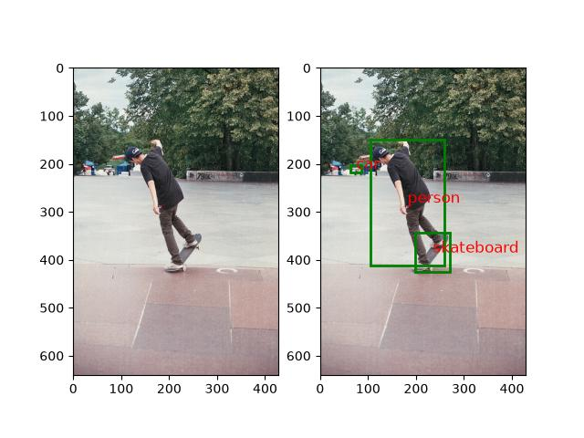
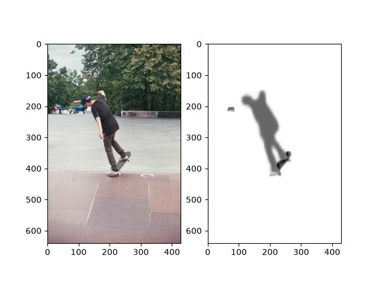

# Instance Segmentation Image Viewer

A Tkinter desktop app that runs a pretrained **Mask R-CNN** on an image you pick and shows either its **segmentation masks** or its **labelled bounding boxes** next to the original. It is built on a small Python package, `newmypackage`, with a dataset loader, image transforms, a model wrapper and plotting. This was a Software Engineering Lab assignment at IIT Kharagpur.

| Bounding boxes | Segmentation |
|---|---|
|  |  |

## Features

- **Open an image** with the `. . . . .` button. The model runs straight away, and the selected path appears in the text box.
- **Choose a view** from the drop-down, *Segmentation* or *Bounding-box*, then click **Go** to switch views without re-running the model.
- Shows the **three most confident detections**. Boxes are labelled with their COCO class names, and the masks of the top three detections are combined.
- Shows a message if **Go** is clicked before an image is chosen, or if the chosen image is not in the annotation file.

## Getting started

Requirements: Python 3 with Tkinter, plus the packages in [`requirements.txt`](requirements.txt): PyTorch, torchvision, NumPy, Pillow and Matplotlib.

```bash
pip install -r requirements.txt
python ImageViewerGUI.py        # run from the repository root
```

The first run downloads the pretrained Mask R-CNN weights (about 170 MB). If Python reports `No module named '_tkinter'`, install Tk support for your Python, for example `brew install python-tk` on macOS or `sudo apt install python3-tk` on Debian/Ubuntu.

The app reads `data/annotations.jsonl` and the images in `data/imgs/`, so choose images from that folder. It writes its rendered views to `output/`.

## The `newmypackage` package

| Module | Contents |
|---|---|
| `model.py` | `InstanceSegmentationModel`, a wrapper around torchvision's `maskrcnn_resnet50_fpn` (COCO-pretrained). Takes a `(3, H, W)` image in `[0, 1]` and returns boxes, masks, class names and scores. |
| `data/dataset.py` | `Dataset`, which reads a JSON Lines annotation file and returns the image, the segmentation PNG and the ground-truth boxes for an index, applying any transforms in order. |
| `data/transforms/` | `BlurImage` (Gaussian), `CropImage` (centre or random), `FlipImage` (horizontal or vertical), `RescaleImage` (to a fixed size or by the shorter side), `RotateImage` |
| `analysis/visualize.py` | `plot_visualization`, which draws the original image next to the masks or the labelled boxes and saves the figure |

The package can be installed on its own:

```bash
pip install .
```

```python
from newmypackage.data.dataset import Dataset
from newmypackage.data.transforms.flip import FlipImage
from newmypackage.data.transforms.blur import BlurImage

ds = Dataset('data/annotations.jsonl', transforms=[FlipImage('horizontal'), BlurImage(2)])
item = ds[0]          # {'image': (H, W, 3) array, 'gt_png_ann': ..., 'gt_bboxes': [[class, x, y, w, h], ...]}
```

## Data

[`data/`](data) holds 10 sample COCO images with their segmentation PNGs. [`data/README.md`](data/README.md) describes the annotation format.

## Author

Deepiha S (20CS30015), Software Engineering Laboratory, IIT Kharagpur.
